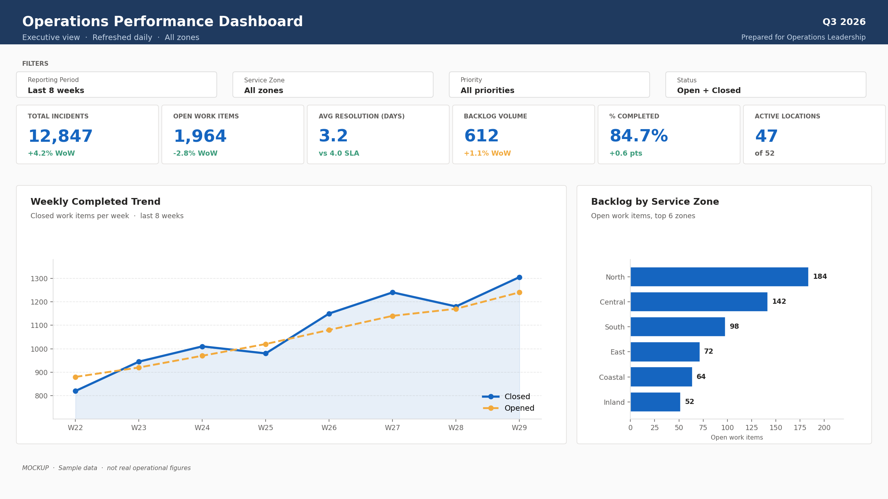
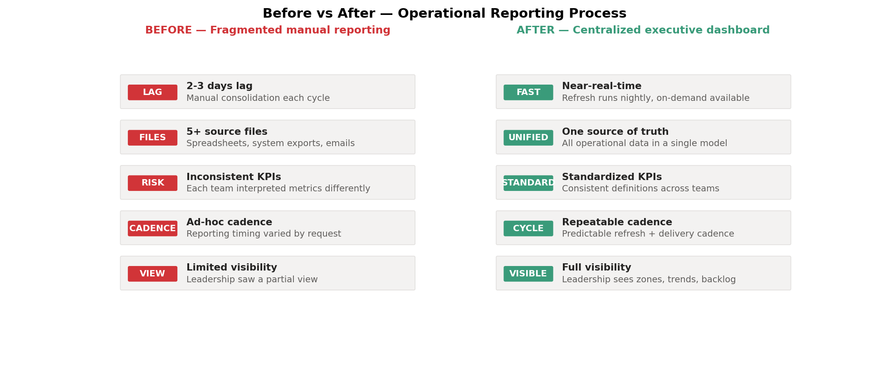
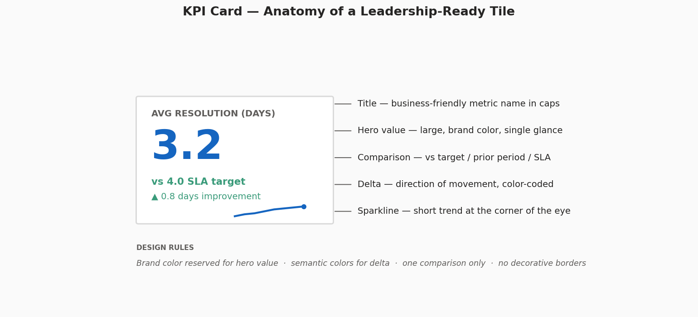
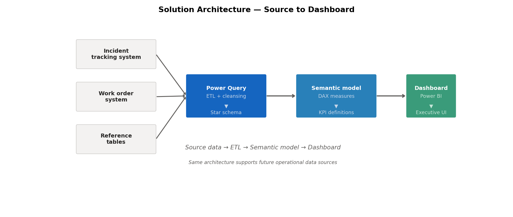

# Executive Operations Dashboard Case Study

<p align="left">
  
  
  
  
</p>

A leadership-ready operations dashboard that consolidates fragmented operational data into a single, KPI-driven decision-support tool — replacing a manual, multi-source reporting cycle with one trusted view.

---

> [!IMPORTANT]
> This case study uses generalized operational examples — incident tracking, work order activity, zone and priority breakdowns — without exposing system names, table structures, or confidential details. The dashboard mockup, KPI definitions, DAX patterns, and architecture all reflect a real reporting solution.



---

## Business Questions This Dashboard Answers

A leadership audience walks up to this report with a small set of recurring questions. The dashboard is designed so each question is answerable in seconds, not minutes.

| Question | Where it lives on the dashboard |
|---|---|
| **What is our current operational backlog and where is it concentrated?** | KPI card *Backlog Volume* + *Backlog by Service Zone* bar chart |
| **Are we hitting target resolution times?** | KPI card *Avg Resolution (days)* with SLA comparison |
| **How is weekly throughput trending — improving or slipping?** | *Weekly Completed Trend* line chart (closed vs opened) |
| **Which service zones have the highest open work right now?** | Zone breakdown, sorted descending |
| **Which priority bands carry the largest unresolved workload?** | Priority distribution slicer + filtered KPI flow |
| **Where should we reallocate resources next?** | Combined view of zones, backlog, and weekly throughput |
| **What share of work has been completed this period?** | KPI card *% Completed* with delta vs prior period |

The dashboard surfaces the answers; leadership owns the decisions.

---

## Business Problem

Before the dashboard existed, operational reporting was fragmented, manual, and slow.

- Reporting required heavy manual consolidation each cycle
- Data lived across multiple systems, files, and reporting processes
- Leadership had no single consolidated view
- Decision-making was slowed by inconsistent updates and reporting lag
- Operational trends were difficult to identify quickly



---

## Project Goals

The dashboard was designed to:

- Centralize operational metrics into one reporting experience
- Define and standardize clear KPI calculations
- Reduce reporting delays and manual consolidation effort
- Improve executive and leadership visibility
- Support prioritization and resource allocation decisions
- Create a scalable reporting structure for ongoing operational monitoring

---

## Dashboard Scope

The dashboard provides visibility into key aspects of operational activity:

- Affected zones and service areas
- Response progress across locations
- Backlog and work status tracking
- Weekly operational activity and trend
- Resource allocation and workload distribution
- Completion and response performance

---

## KPI Definitions

The dashboard standardizes a small set of KPIs so every team interprets them the same way.

| KPI | Definition | Where it appears |
|---|---|---|
| **Total Incidents Tracked** | Count of all incidents in scope | Top KPI card |
| **Open Work Items** | Active operational items, not yet closed | Top KPI card |
| **Average Resolution Time** | Mean days between open and close on completed items | Top KPI card with SLA comparison |
| **Backlog Volume** | Total items still pending action | Top KPI card |
| **% Completed** | Closed work items ÷ total tracked | Top KPI card with delta |
| **Active Response Locations** | Locations with ongoing response activity | Top KPI card |
| **Weekly Progress Trend** | Closed work items per week | Trend chart |
| **Priority Workload Distribution** | Volume by urgency / priority band | Slicer + breakdown |



---

## Dashboard Design Approach

The dashboard is designed primarily for executive and leadership stakeholders, so the experience emphasizes clarity, speed, and usability.

Design principles:

- **Quick-scan visibility** for high-level decision-making
- **KPI cards** for immediate status recognition
- **Trend visuals** to show movement over time
- **Geographic / tabular drilldown** for operational depth when needed
- **Layout focused on clarity** over clutter
- **Consistent labeling** and business-friendly metric names

The goal is a dashboard interpretable in a few seconds while still supporting deeper analysis on request.

---

## Sample DAX Logic

A handful of representative measures from the reporting model.

```DAX
Total Incidents =
COUNTROWS('Incidents')

Open Work Items =
CALCULATE(
    COUNTROWS('WorkItems'),
    'WorkItems'[Status] <> "Closed"
)

Closed Work Items =
CALCULATE(
    COUNTROWS('WorkItems'),
    'WorkItems'[Status] = "Closed"
)

Average Resolution Time (Days) =
AVERAGEX(
    FILTER('WorkItems', NOT(ISBLANK('WorkItems'[ClosedDate]))),
    DATEDIFF('WorkItems'[CreatedDate], 'WorkItems'[ClosedDate], DAY)
)

Percent Completed =
DIVIDE([Closed Work Items], [Total Incidents], 0)

Weekly Completed Trend =
CALCULATE(
    [Closed Work Items],
    DATESINPERIOD('Calendar'[Date], MAX('Calendar'[Date]), -7, DAY)
)
```

---

## Architecture

```
Source data  →  Power Query (ETL + cleansing)  →  Semantic model (DAX, KPIs)  →  Power BI dashboard
```



### Workflow

1. Source data collected from multiple operational inputs
2. Standardized through transformation and modeling steps
3. A Power BI semantic model defines relationships, business logic, and KPIs
4. The dashboard surfaces leadership-ready metrics + operational detail in a single experience

The architecture supports both reporting consistency and future extensibility as operational data sources evolve.

---

## Business Impact

The dashboard delivered measurable value by improving the speed, consistency, and usefulness of operational reporting.

- Significantly reduced manual reporting effort
- Improved reporting speed through a centralized workflow
- Enabled near-real-time operational visibility for leadership
- Increased KPI consistency and reporting interpretation
- Improved confidence in leadership reporting
- Supported faster prioritization and more informed resource decisions

---

## Tech Stack

- **Power BI Desktop** — semantic model + report
- **DAX** — KPI logic and time-intelligence patterns
- **Power Query (M)** — ETL and source standardization
- **Star schema** — fact + dimension modeling for performance and clarity

---

## Repository Layout

```
executive-operations-dashboard-case-study/
├── README.md
├── images/
│   ├── 01-dashboard-mockup.png    Full dashboard layout
│   ├── 02-kpi-card-detail.png     KPI card design close-up
│   ├── 03-architecture.png        Source-to-dashboard flow
│   └── 04-before-after.png        Process improvement panel
└── scripts/
    └── generate_visuals.py        Regenerates the four images
```

---

## Key Takeaway

A well-designed Power BI dashboard does more than visualize data. By consolidating fragmented operational inputs, standardizing KPI definitions, and presenting information in a leadership-friendly format, the solution helped transform reporting from a manual process into a strategic decision-support tool.

---

## Connect

- 🔗 [LinkedIn](https://www.linkedin.com/in/jas0n-ch0i/)
- 📧 [Email me](mailto:jchoi815@gmail.com)
